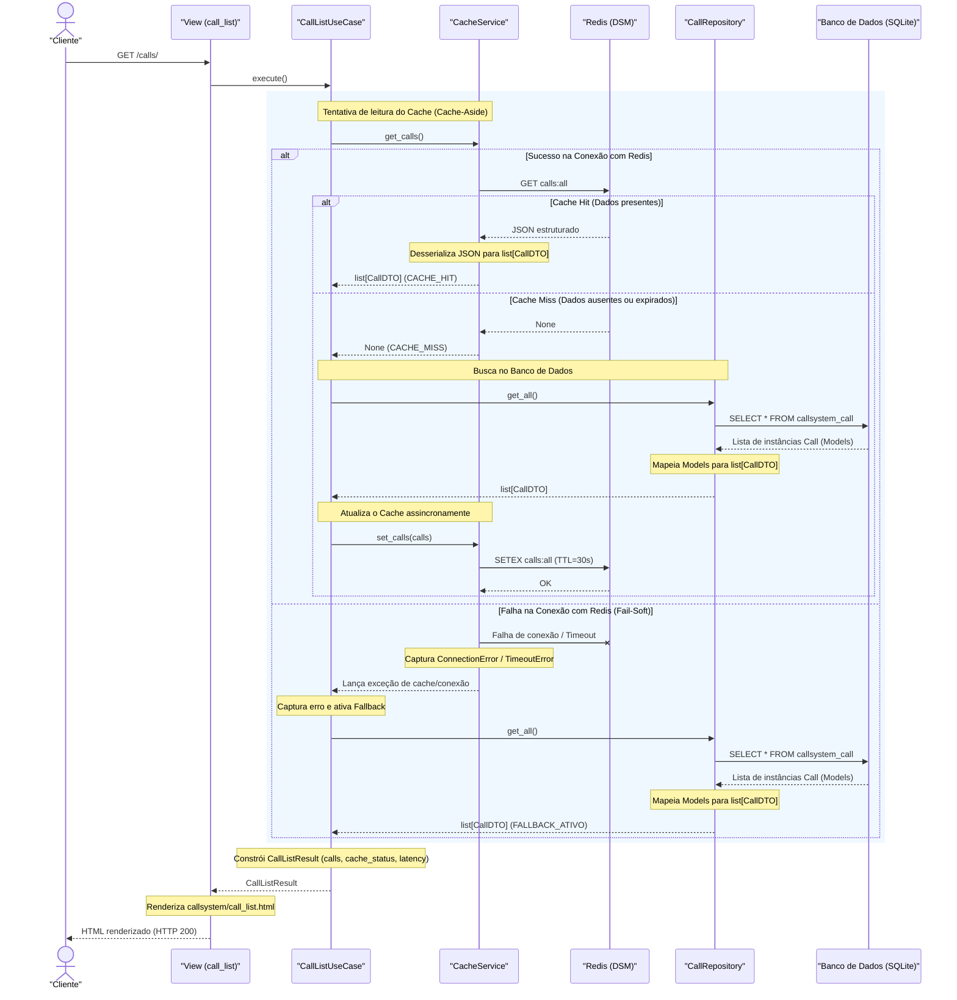

# Diagrama de Sequência — Aula de Redis com Django & Python

Este documento apresenta o diagrama de sequência detalhado que representa a arquitetura refatorada do projeto `django-redis-demo` seguindo os princípios de **Clean Code**, **SOLID** (SRP, DIP) e a separação clara de responsabilidades com o padrão **Cache-Aside** (Lazy Loading) e suporte a **Fail-Soft (Fallback)**.

## 📊 Diagrama de Sequência da Listagem de Chamados

## 🔍 Explicação dos Componentes no Fluxo

1. **`View (call_list)`**: Tem responsabilidade única baseada no protocolo HTTP (SRP). Recebe o request, delega toda a orquestração de lógica para o caso de uso e renderiza o template HTML correspondente.
2. **`CallListUseCase`**: Orquestrador central que implementa as regras de negócio distribuídas (Cache-Aside + Fail-Soft). Recebe `CacheService` e `CallRepository` via injeção de dependências (DIP).
3. **`CacheService`**: Encapsula totalmente a conexão física e lógica com o **Upstash Redis**. Responsável por serializar/desserializar a lista de `CallDTO` utilizando representações em JSON.
4. **`CallRepository`**: Responsável exclusivo por se comunicar com o banco de dados SQLite. Converte o resultado bruto retornado pelas queries do ORM Django para objetos imutáveis e padronizados `CallDTO` antes de trafegá-los para outras camadas.
5. **`CallDTO`**: Nosso contrato estruturado e imutável que trafega os dados de forma limpa pela aplicação e pelo cache compartilhado distribuído.
